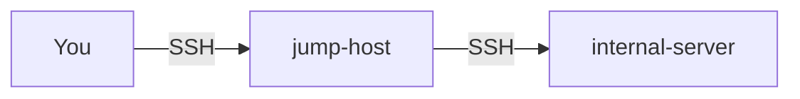

# ProxyJump

OpenSSH's `ProxyJump` directive routes connections through intermediate hosts (jump hosts / bastion servers). Combined with overseer, you can automatically activate jump host tunnels based on your network context.

## What ProxyJump Does

ProxyJump transparently tunnels your SSH connection through one or more intermediate hosts. You connect to the jump host first, and it forwards your connection to the final destination. This is the standard way to access internal hosts that aren't directly reachable from the internet.



## Basic Usage

### SSH Config

```ssh-config
Host internal-server
    HostName 10.0.1.50
    User deploy
    ProxyJump gate.example.com
```

Now `ssh internal-server` transparently connects through `gate.example.com`.

### Command Line

```sh
ssh -J gate.example.com deploy@10.0.1.50
```

## Chained Jumps

ProxyJump supports chaining through multiple hosts:

```ssh-config
Host deep-internal
    HostName 10.10.1.50
    ProxyJump gate.example.com,dmz.example.com
```

This connects through `gate` first, then `dmz`, then reaches `deep-internal`:


You can also reference other Host entries:

```ssh-config
Host gate
    HostName gate.example.com
    User admin

Host dmz
    HostName 10.0.0.1
    ProxyJump gate

Host deep-internal
    HostName 10.10.1.50
    ProxyJump dmz
```

## Datacenter Gateway Patterns

A common pattern uses a gateway host that provides access to all hosts in a datacenter:

```ssh-config
# Gateway host — reachable from the internet
Host dc-gate
    HostName gate.dc1.example.com
    User admin
    IdentityFile ~/.ssh/id_ed25519

# All dc1-* hosts go through the gateway
Host dc1-*
    ProxyJump dc-gate
    User deploy

# Individual hosts
Host dc1-web
    HostName 10.0.1.10

Host dc1-db
    HostName 10.0.1.20

Host dc1-cache
    HostName 10.0.1.30
```

With overseer managing the `dc-gate` connection, all `dc1-*` hosts become instantly accessible (especially with [ControlMaster](/advanced/ssh-controlmaster)).

## Overseer + ProxyJump

### Keep the Jump Host Alive

Configure overseer to maintain the jump host connection:

```hcl
# config.hcl
context "remote-work" {
  locations = ["home"]
  actions {
    connect = ["dc-gate"]
  }
}
```

When you're at home, overseer keeps `dc-gate` connected. Any `ssh dc1-web` reuses that connection through ProxyJump.

### Direct Connection Bypass

When you're on the datacenter LAN, you don't need the jump host. Use [Dynamic Tunnels](/advanced/dynamic-tunnels) with `Match exec` to bypass ProxyJump when you're on the local network:

```ssh-config
# When at the office, connect directly
Match host dc1-* exec "test $(cat ~/.config/overseer/location.txt 2>/dev/null) = office"
    ProxyJump none

# Default: go through the gateway
Host dc1-*
    ProxyJump dc-gate
```

::: info Match Order
SSH processes `Match` blocks in order. Place the direct-connection match **before** the `Host` block with `ProxyJump` to ensure it takes precedence.
:::

## Status Output

When you use ProxyJump with overseer-managed tunnels, `overseer status` displays the full hop chain as a cascading tree:

```plain
  ✓ deep-internal (PID: 4521, Age: 1h 30m)
  └── → gate.example.com:22
      └── → dmz.example.com:22
          └── → 10.10.1.50:22
```

Use `overseer status -R` to resolve IP addresses in the hop chain to hostnames via reverse DNS.

## Combining with ControlMaster

ProxyJump and ControlMaster work together — the jump host connection is multiplexed:

```ssh-config
Host *
    ControlMaster auto
    ControlPath ~/.ssh/sockets/%C
    ControlPersist 600

Host dc-gate
    HostName gate.dc1.example.com
    User admin

Host dc1-*
    ProxyJump dc-gate
    User deploy
```

First connection to any `dc1-*` host opens the gate connection. Subsequent connections reuse it — even to different `dc1-*` hosts — because the ControlMaster socket for `dc-gate` is already established.
