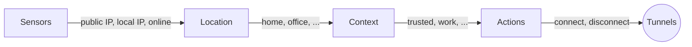

# What is Overseer?

Overseer is an SSH tunnel manager with contextual awareness. It detects your network environment, determines where you are, and automatically connects or disconnects SSH tunnels based on your security context.

## The Problem

If you rely on SSH tunnels for work — SOCKS proxies, port forwards, jump hosts, VPNs — you know the routine: arrive at the office and disconnect your VPN, go to a coffee shop and reconnect it, come home and switch to your home server tunnels. Each transition means manual steps and forgotten connections.

Overseer eliminates this friction by making your SSH tunnels context-aware.

## How It Works

Overseer runs as a background daemon that continuously monitors your network environment through **sensors** — lightweight probes that detect your public IP, local IP, and online status. When sensor readings change (you moved to a new network), overseer evaluates your configuration to determine:

1. **Location** — Where are you? (home, office, coffee shop)
2. **Context** — What security posture applies? (trusted, corporate, untrusted)
3. **Actions** — Which tunnels to connect or disconnect?



Context changes happen within seconds of a network change. You close your laptop at the office, open it at home, and your tunnels are already reconfigured by the time your shell prompt appears.

## Key Concepts

### Sensors

Sensors are the inputs to overseer's decision engine. They detect:

| Sensor | Description |
|--------|-------------|
| `public_ipv4` | Your public IPv4 address (detected via DNS) |
| `public_ipv6` | Your public IPv6 /64 prefix (privacy extensions ignored) |
| `local_ipv4` | Your local LAN IPv4 address |
| `online` | Network connectivity status (TCP probe to well-known hosts) |

Sensors use consensus-based detection (querying multiple DNS resolvers) and hysteresis to avoid flapping on transient network changes.

### Locations

Locations are named network environments identified by sensor conditions. A location might be "home" (matching your home IP), "office" (matching your corporate IP range), or the built-in "unknown" (no conditions matched).

```hcl
location "home" {
  display_name = "Home Network"
  conditions {
    public_ip = ["203.0.113.42"]
  }
}
```

### Contexts

Contexts group one or more locations into a security posture and define actions to take. A "trusted" context might reference your home and office locations, connecting your dev server tunnels. An "untrusted" context activates when you're on an unknown network, connecting your VPN.

```hcl
context "trusted" {
  locations = ["home", "office"]
  actions {
    connect    = ["dev-server", "home-lab"]
    disconnect = ["vpn"]
  }
}
```

Contexts are evaluated in order — the first match wins. The built-in `untrusted` context acts as a catch-all fallback.

### Actions

Actions are the tunnel operations triggered by context changes:

- **connect** — Start SSH connections to the listed host aliases
- **disconnect** — Tear down SSH connections to the listed host aliases

Host aliases correspond to entries in your `~/.ssh/config`. Overseer manages the SSH processes — it doesn't replace your SSH config, it builds on it.

## What Overseer Is Not

Overseer is not an SSH replacement. It manages `ssh` processes using your existing `~/.ssh/config`. All SSH features — keys, agent forwarding, ProxyJump, ControlMaster — work exactly as configured. Overseer just decides *when* to connect and disconnect.

## Platforms

Overseer runs on **macOS** (Apple Silicon and Intel) and **Linux** (x86_64 and ARM64).

## Next Steps

- [Installation](/guide/installation) — Get overseer on your system
- [Quick Start](/guide/quick-start) — Set up your first context-aware configuration
- [Configuration](/guide/configuration) — Full reference for all config options
